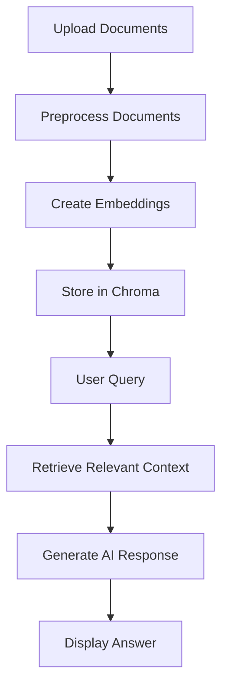

# 📚 Document Chat Assistant 🤖

<div align="center">
    
    
    
</div>

## 🌟 Project Overview

Revolutionize document interaction with our cutting-edge **Document Chat Assistant**! This intelligent application empowers users to upload, analyze, and explore multiple documents through an intuitive, AI-powered chat interface.

---

## ✨ Key Features

| Feature | Description | 🚀 Highlights |
|---------|-------------|---------------|
| 🗂️ Multi-Document Upload | Upload PDF and TXT files seamlessly | Process multiple documents simultaneously |
| 🧠 Smart Document Processing | Advanced document chunking and embedding | Uses state-of-the-art NLP techniques |
| 💬 RAG-Powered Interaction | Context-aware response generation | Combines retrieval and language models |
| 💾 Persistent Document Storage | Efficient embedding management | Utilizes Chroma for quick information retrieval |
| 🤝 Interactive Chat Interface | Natural language document exploration | Ask complex questions, get precise answers |
| 🔄 Flexible Reset Options | Manage chat and database | Easy reset for new document sets |

---


## 🚀 Getting Started

### Prerequisites

- 🐍 Python 3.8+
- 📦 pip package manager

### Installation

```bash
# Clone the repository
git clone https://github.com/yourusername/document-chat-assistant.git

# Navigate to project directory
cd document-chat-assistant

# Create virtual environment
python -m venv venv
source venv/bin/activate  # On Windows, use `venv\Scripts\activate`

# Install dependencies
pip install -r requirements.txt
```

### Running the Application

```bash
# Launch Streamlit application
streamlit run app.py
```

---

## 🔍 How It Works



### Code Breakdown

#### Document Upload and Processing

**File Uploader**:
```python
uploaded_files = st.file_uploader(
    "Upload Documents", 
    type=["pdf", "txt"], 
    accept_multiple_files=True
)
```

**Document Processing Workflow**:
```python
def process_documents(uploaded_files):
    documents = []
    for file in uploaded_files:
        # Use appropriate loader based on file type
        if file.type == "application/pdf":
            loader = PyPDFLoader(file)
        else:
            loader = TextLoader(file)
        
        # Split documents into chunks
        text_splitter = RecursiveCharacterTextSplitter(
            chunk_size=500,
            chunk_overlap=50
        )
        document_chunks = text_splitter.split_documents(loader.load())
        
        # Create embeddings
        embeddings = HuggingFaceEmbeddings()
        vectorstore.add_documents(document_chunks)
        
    return documents
```

#### RAG Prompt Template
```python
prompt_template = """
You are a helpful assistant. Answer the question based strictly on the provided context.
Think step by step and provide a detailed, accurate response.

Context:
{context}

Question: {question}
Helpful Answer:"""
```

### Key Technologies

- 🧠 **AI/ML**: 
  - LangChain
  - HuggingFace Embeddings
  - ChatGroq
- 🌐 **Web Framework**: Streamlit
- 💾 **Vector Database**: Chroma

---

## 🤝 Contributing

Interested in improving the Document Chat Assistant? We welcome contributions!

1. Fork the repository
2. Create your feature branch (`git checkout -b feature/AmazingFeature`)
3. Commit your changes (`git commit -m 'Add some AmazingFeature'`)
4. Push to the branch (`git push origin feature/AmazingFeature`)
5. Open a Pull Request

---

## 📜 License

Distributed under the MIT License. See `LICENSE` for more information.

---


**Created with ❤️ by AI Enthusiasts**
